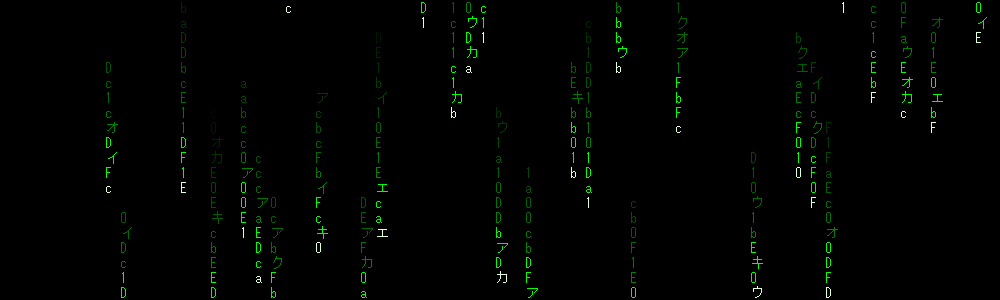

<!-- Matrix-style banner -->

  

<!-- Typing effect banner -->

  

# **Fernando Vilas Paz**
After more than 20 years in the hospitality industry, I made a bold decision to completely change my life and dive headfirst into the world of programming. I’m now a full-time student at [42 Málaga](https://42malaga.com), where I’m building solid foundations in low-level programming, cybersecurity, and system administration.

> _"Sometimes you win, other times you learn."_
> I believe in learning by doing — failing fast and improving faster.

---

## ⭐ Featured Projects

### 👨‍🍳 Cañitas Maite · Interactive Training Platform
Interactive training platform for a Michelin-star restaurant team.  
Built to centralize menu knowledge, allergens, quizzes and internal certification.  
Built with vanilla HTML, CSS and JavaScript, focused on usability and real-world constraints.

- 🍽️ **[View Live demo](https://fvilpaz.github.io/N_Canitas/)**
- 📦 **[Check Code](https://github.com/fvilpaz/N_Canitas)**

---

### 🚗 Redondela Automoción · Business Solutions Platform
Professional digital presence and service management for the automotive industry.  
Designed for customer conversion, appointment scheduling, and technical service catalog.  
Built with a focus on responsive performance and seamless user experience.

- 🛠️ **[View Live demo](https://fvilpaz.github.io/redondela-automocion/)**
- 📦 **[Check Code](https://github.com/fvilpaz/redondela-automocion)**

---
## 💡 Inspirations & Mentors

I wouldn't be here without the guidance of world-class educators and the community:
- 🎓 **[David J. Malan:](https://cs.harvard.edu/malan/)** For the foundations of CS50 Harvard.
- 🧠 **[Oceano:](https://www.youtube.com/@onaecO)** For the deep-dives into 42's logic and [system mindset].
- 👨‍💻 **[Mouredev:](https://moure.dev/)** For practical tutorials and guidance on web development and programming.
- 👥 **[42 Community:](https://www.42malaga.com/)** For teaching me that the best way to learn is to help others.

---
## 🎯 My Profile

- 🛫 Emigrated alone at 19 — resilience, independence, and strong work ethic. 
- 🌍 Multilingual and adaptable to fast-paced, international environments.
- 🧠 Real-world experience managing high-pressure teams and customer-facing situations.
- 🔄 Not afraid to start over — I'm committed to lifelong learning and reinvention.

---

## 💻 Currently Learning & Career Path

- 🏫 **42 Málaga — Core Curriculum (Full-time)**
     ▸ Deep dive into low-level programming and system fundamentals through project-based learning.
     ▸ C Programming: Memory management, pointers, Makefiles, and system calls.
     ▸ Systems & Automation: Bash scripting, Linux administration (UFW, SSH, auditd, cron).
     ▸ Security: Cybersecurity fundamentals and system hardening.
     ▸ Methodology: Daily peer-to-peer learning focused on problem-solving, autonomy, and clean code.
  
  ⚡︎
- 🎓 **CS50 — Harvard University (Computer Science Foundations)**
     ▸ Solid foundations in computer science and computational thinking.
     ▸ Core topics: Algorithms, data structures, memory, abstraction, and problem-solving.
     ▸ Languages & tools: C, Python, SQL, HTML, CSS, JavaScript.
     ▸ Strong emphasis on understanding how computers work under the hood.

  ⚡︎
- 🚀 **MoureDev Pro — Structured Learning Path**
     ▸ Following a comprehensive roadmap to master modern development and backend logic.
     ▸ Languages: Java (OOP), Python (Beginner → Intermediate), and JavaScript.
     ▸ Logic & Data: Programming logic, SQL, and database management.
     ▸ Advanced: Backend development with Python and advanced Git/GitHub workflows.
     ▸ Soft Skills: Meta-learning (how to study programming) and terminal mastery.

  ⚡︎
- 🌐 **Official Web Development Training (Scheduled for Feb 2026)**
     ▸ Professional Certification (IFCD0110) focused on industry-standard web technologies.
     ▸ MF0950_2: Web Page Construction (210h).
     ▸ MF0951_2: Software Component Integration in Web Pages (180h).
     ▸ MF0952_2: Web Page Publishing (90h).
     ▸ MP0278: Non-labor Professional Internship (80h).
  
  ---
  
## 🔨 Projects & Challenges

- ✅ **Born2BeRoot** – Hardened Linux VM: auditd, firewall (UFW), secure sudoers.
- ✅ **libft** – C standard library functions built from scratch.
- ✅ **ft_printf** – Custom printf using variadic functions & format parsing.
- ✅ **get_next_line** – Efficient file reader using static buffers.
- ✅ **mini_talk** – Client-server communication using UNIX signals.
- ✅ **push_swap** – Stack-based sorting with optimized instructions.
- 🚧 **so_long** – 2D game: map parsing, enemy movement, flood fill.
- 🕳️ Black Hole approaching… currently fighting it with clean code, sleep deprivation and pure willpower.

---

## 🛠️ Tech Stack

**Systems & Low Level** 

**Development & Databases** 

**Tools & Environment** 

---

## 📊 GitHub Activity

- Daily coding practice through the 42 Málaga curriculum
- Projects focused on C, system programming and problem-solving
- Hands-on learning: building, breaking, and fixing real code

---

## 🤝 Looking to Collaborate On

- Educational or beginner-friendly open source projects
- Shell scripting, system automation, and C-based tools
- Anything that helps me sharpen my skills while learning from others

---

## 📫 Let’s Connect

- 💼 [LinkedIn](https://www.linkedin.com/in/fernando-vilas-paz-1626901a9)
- 📧 fvilpaz@gmail.com

---

