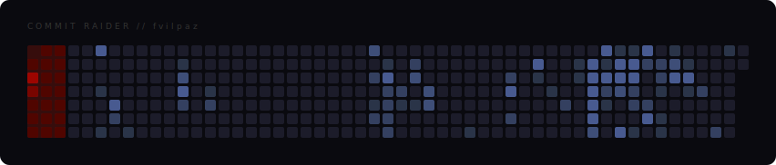

<!-- Matrix-style banner -->

  

<!-- Typing effect banner -->

  

# **Fernando Vilas Paz**
After more than 20 years in the hospitality industry, I made a bold decision to completely change my life and dive headfirst into the world of programming. I trained at 42 Málaga,currently studying CS50 Harvard, and I'm now a co-founder and Full Stack Developer <!-- at [Q·REAS Tech](https://qreasteam.com) --> building real tools for real businesses.

> _"Sometimes you win, other times you learn."_
> I believe in learning by doing — failing fast and improving faster.

📄 **[View my CV](https://fvilpaz.github.io/cv/)**

---

## ⭐ Featured Projects

<!--### 🏢 Q·REAS Tech · Co-founder & Full Stack Developer
ERP, automation and internal tools for the hospitality industry.
Built with a multidisciplinary team: CEO, CTO, senior architect and infrastructure specialist.
Developing lightweight apps and web interfaces that solve real operational problems.

- 👤 **[Meet the team](https://qreasteam.com/equipo)** -->

### 🚀 Freelancer · Full Stack Developer
Developing custom solutions and automation tools to streamline operational processes.

- 🛠️ **Stack:** React, Node.js, API integrations, and database management.
- 📈 **Focus:** Building lightweight, efficient applications centered on user experience.
- 🌐 **Availability:** Open to international projects and remote collaborations.

---
### 🧠 MasterMind · AI-Powered Learning Environment
A personal knowledge system and AI trainer built around an Obsidian vault.
Combines a Flask web app with Claude/Gemini APIs to deliver Socratic coaching
across multiple learning tracks (CS50, MoureDev, Google, Bash).

Forces mastery through guided reasoning, Pomodoro-structured sessions,
strict validation gates, and persistent session logs synced via Git.

- 📄 **[README](https://github.com/fvilpaz/MasterMind#readme)**
- 🌐 **[fv-mastermind.com](https://fv-mastermind.com)**

---

### ☄️ Gemini The Cosmic Runner · AI-Integrated Game
An interactive countdown game built and deployed using Google Cloud Run and the Gemini AI API.
Showcases modern serverless deployment, prompt engineering, and real-time AI integration in a gamified environment.

- 📄 **[README](https://github.com/fvilpaz/cosmic-gemini-vibe#readme)**
- 🎮 **[Play the Game](https://gemini-the-cosmic-runner-225901143372.europe-west2.run.app/)**

---

### 🏖️ AuryApp · Beach Club Management App
Full Django web app built for a real beach club in active use: shift planning,
event management with visual floor plans, staff scheduling, daily task checklists,
voice notes, and a six-theme design system. Deployed on Google Cloud Run with Neon PostgreSQL.

- 📄 **[README](https://github.com/fvilpaz/auryapp#readme)**
- 📘 **[User Manual](https://github.com/fvilpaz/auryapp/blob/main/MANUAL.md)**

---

### 🍷 SoMeliaR · Wine Inventory & Stock Control
Django web app for hotel wine cellar management: real-time stock alerts,
supplier orders via email, AI-powered restock analysis (Google Gemini),
sommelier notes with voice dictation, and Excel bulk import.
Built for Meliá Hotels International.

- 📄 **[README](https://github.com/fvilpaz/SoMeliaR#readme)**
- 📘 **[User Manual](https://github.com/fvilpaz/SoMeliaR/blob/main/MANUAL.md)**

---

### 👨‍🍳 Cañitas Maite · Interactive Training Platform
Interactive training platform for a Michelin-star restaurant team.  
Built to centralize menu knowledge, allergens, quizzes and internal certification.  
Built with vanilla HTML, CSS and JavaScript, focused on usability and real-world constraints.

- 📄 **[README](https://github.com/fvilpaz/N_Canitas#readme)**
- 🍽️ **[View Live demo](https://fvilpaz.github.io/N_Canitas/)**

---

### 🚗 Redondela Automoción · Business Solutions Platform
Professional digital presence and service management for the automotive industry.  
Designed for customer conversion, appointment scheduling, and technical service catalog.  
Built with a focus on responsive performance and seamless user experience.

- 📄 **[README](https://github.com/fvilpaz/redondela-automocion#readme)**
- 🛠️ **[View Live demo](https://fvilpaz.github.io/redondela-automocion/)**

---

## 💡 Inspirations & Mentors

I wouldn't be here without the guidance of world-class educators and the community:

- 🎓 **[David J. Malan:](https://cs.harvard.edu/malan/)** For the foundations of CS50 Harvard.
- 👨‍💻 **[Mouredev:](https://moure.dev/)** For practical tutorials and guidance on web development and programming.
- 👥 **[42 Community:](https://www.42malaga.com/)** For teaching me that the best way to learn is to help others.
- 🧠 **[Oceano:](https://www.youtube.com/@onaecO)** For the deep-dives into 42's logic and [system mindset].

---

## 🎯 My Profile

- 🛫 Emigrated alone at 19 — resilience, independence, and strong work ethic. 
- 🌍 Multilingual and adaptable to fast-paced, international environments.
- 🧠 Real-world experience managing high-pressure teams and customer-facing situations.
- 🔄 Not afraid to start over — I'm committed to lifelong learning and reinvention.

---

## 💼 Experience

<!-- Q·REAS Tech · Co-founder & Full Stack Developer
     ERP, automation and internal tools for the hospitality industry.
     Stack: Python, Django, JavaScript, HTML/CSS.
     Real product · Real users · Real deadlines. -->

### 🚀 Freelancer · Full Stack Developer
Building custom tools and automation for real clients and real operational problems.
- Stack: Python, Django, React, Node.js, API integrations
- Focus: lightweight apps that solve actual business pain points
- Open to remote and international projects

---

## 📚 Formation

- 🏫 **42 Málaga** — Low-level programming, C, systems, security and peer-based learning
- 🎓 **CS50 Harvard** — Computer science foundations: algorithms, memory, data structures
- 🌐 **IFCD0110 Web Development Certification** — 🚧 In progress · Final stretch
- 🚀 **MoureDev Pro** — Full stack roadmap: Python, Java, SQL and backend development

---
  
## 🔨 Projects & Challenges

- ✅ **Born2BeRoot** – Hardened Linux VM: auditd, firewall (UFW), secure sudoers.
- ✅ **libft** – C standard library functions built from scratch.
- ✅ **ft_printf** – Custom printf using variadic functions & format parsing.
- ✅ **get_next_line** – Efficient file reader using static buffers.
- ✅ **mini_talk** – Client-server communication using UNIX signals.
- ✅ **push_swap** – Stack-based sorting with optimized instructions.
- 🚧 **so_long** – 2D game: map parsing, enemy movement, flood fill.
- 🕳️ **Black Hole caught up** - I left the campus, co-founded a startup, and kept building. The learning never stopped.

---

## 🛠️ Tech Stack

**Systems & Low Level** 

**Development & Databases** 

**Tools & Environment** 

---

## 🤝 Looking to Collaborate On

- Real-world tools that solve real problems
- Django / Python backend projects
- ERP modules, automation and business logic
- Shell scripting, system automation, and C-based tools
- AI-integrated tools that solve actual operational problems

---

## 📫 Let's Connect

- 💼 [LinkedIn](https://www.linkedin.com/in/fernando-vilas-paz-1626901a9)
- 📧 fvilpaz@gmail.com
- 📄 [CV](https://fvilpaz.github.io/cv/)

---

## 📊 GitHub Activity

  

  🔴 <strong>Commit Raider</strong> · 52 weeks of real contributions · updated daily

---
